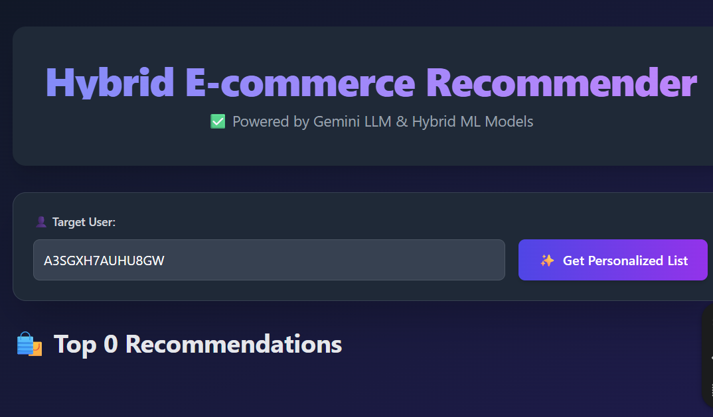

# llm_product_recommender
# 🛒 Hybrid E-commerce Product Recommender with Gemini LLM

## Project Deliverables
This project successfully implements a hybrid recommendation engine, generating highly accurate product suggestions backed by dynamic, personalized justifications created by the Gemini LLM.

## 🎯 Problem Statement
The goal is to move beyond generic "Items you might like" recommendations. We aim to increase user trust and engagement by providing a clear, natural-language answer to the question: "Why was this product chosen specifically for me?" This requires integrating powerful, data-driven machine learning models with advanced generative AI.

## ✅ Solution Overview and Key Benefits
The system uses a Microservice Architecture to run two distinct prediction models (Collaborative Filtering and Content-Based Filtering) and combines their strengths to guide the final output of the Large Language Model.

| Feature              | Core Function                              | Key Benefit                                                                 |
|-----------------------|--------------------------------------------|-----------------------------------------------------------------------------|
| **Hybrid Scoring**    | Combines SVD (CF) and TF-IDF (CBF) scores into one Final Score. | Overcomes Cold Start and Filter Bubble issues inherent in single-model systems, leading to higher Recommendation Accuracy. |
| **Dynamic LLM Persona** | Node.js identifies the dominant model factor (CF or CBF). | Ensures the explanation is always relevant: it uses Social Proof (what peers like) or Personal Preference (what features match your history). This is key for LLM Explanation Quality. |
| **Microservice Architecture** | Decoupled Node.js API Gateway (5000) and Python ML Engine (8000). | Guarantees stability, speed, and scalability, as Node.js handles rapid API traffic while Python manages complex, heavy computation. |

## 💻 System Architecture and Design
The application is structured as a three-tier system communicating over network ports:

1. **Frontend (`frontend/index.html`)**
   - **Role**: Single-page React application that displays the dashboard, takes user input, and makes API calls.
   - **Connection**: Calls the Node.js API Gateway on Port 5000.

2. **Backend API Gateway (`backend`) - (Node.js/Express on Port 5000)**
   - **Role**: Coordinator and Data Enricher.
   - **Action**: Fetches product display details from MongoDB, manages the LLM API call (Gemini), and constructs the final JSON response for the frontend.
   - **Data Retrieval**: Calls the Python Microservice (Port 8000) via HTTP to get the raw ML scores.

3. **ML Microservice (`recsys_python`) - (Python/Flask on Port 8000)**
   - **Role**: Calculation Engine.
   - **Action**: Connects directly to MongoDB, runs the hybrid algorithm (SVD + TF-IDF), and returns a technical score and a `dominant_factor` (CF/CBF) to the Node.js layer.

## IV. Hybrid Recommendation Logic
The system is trained on a dense subset of Amazon Health & Personal Care reviews.

- **Collaborative Filtering (CF)**: Implemented using SVD from the `surprise` library. This model trains on the User-Item-Rating triads to predict a numerical rating (\( \hat{R}_{u,i} \)), simulating community trust.
- **Content-Based Filtering (CBF)**: Uses TF-IDF Vectorization on product descriptions/features to build a user profile and find items with matching attributes (Cosine Similarity).
- **Final Score**: The scores are weighted and combined:
  \[
  \text{Hybrid Score} = (0.7 \times \text{CBF Score}) + (0.3 \times \text{CF Score})
  \]

## V. LLM Integration and Explanation Quality
The Node.js controller uses the `dominant_factor` from Python to select the appropriate LLM Persona for the final explanation text.

| Dominant Factor | LLM Persona            | Explanation Style and Tone                                      |
|-----------------|-------------------------|-----------------------------------------------------------------|
| **CF**          | Community Expert        | Warm, enthusiastic. Focuses on predicted high ratings and social proof ("similar customers love this"). |
| **CBF**         | Personal Shopping Consultant | Direct, knowledgeable. Focuses on feature alignment ("This product's [specific features] match your past interest"). |

## VI. User View 


      

## 🚀 Setup and Execution Instructions

### Prerequisites (For Running Locally)
- Node.js and npm.
- Python 3.10+ with Virtual Environment (`venv`).
- Gemini API Key (in `backend/.env`).
- MongoDB Atlas (seeded with the filtered data).

### Running the Application
1. **Start Python ML Microservice (Port 8000):**
   ```bash
   cd recsys_python
   .\venv\Scripts\activate
   (venv) python engine.py

2. **Start Node.js API Gateway (Port 5000):**

    Action: Launches the main API server that coordinates Python and the LLM.

    ```bash
    cd backend
    npm start

3. **Launch Frontend**

    Action: Open the final file in your web browser.

    Open frontend/index.html in your browser.